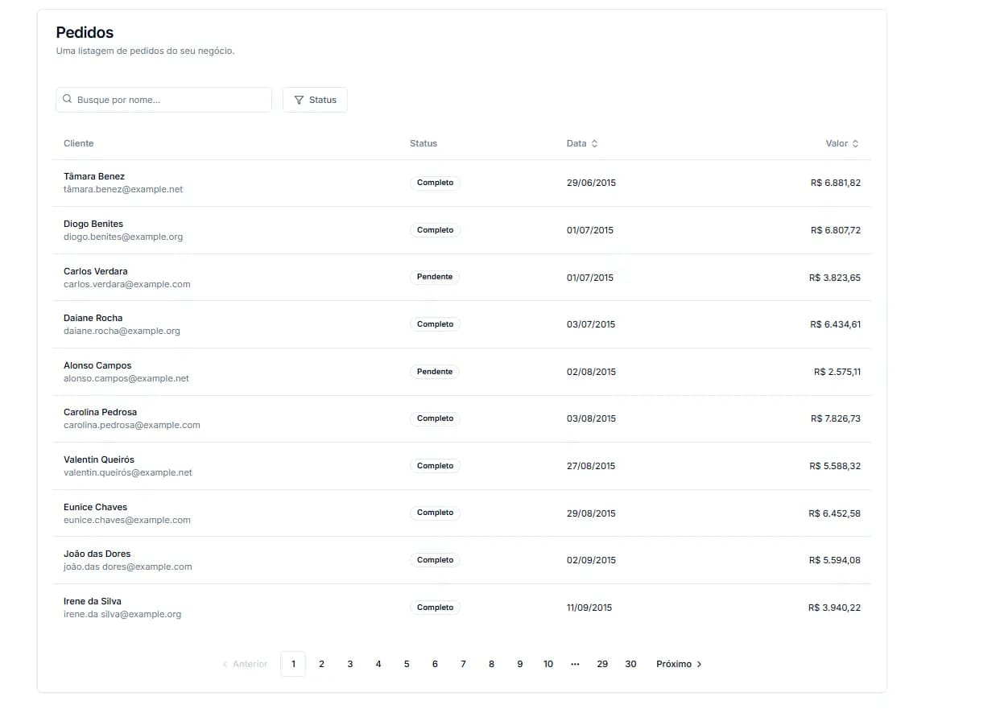
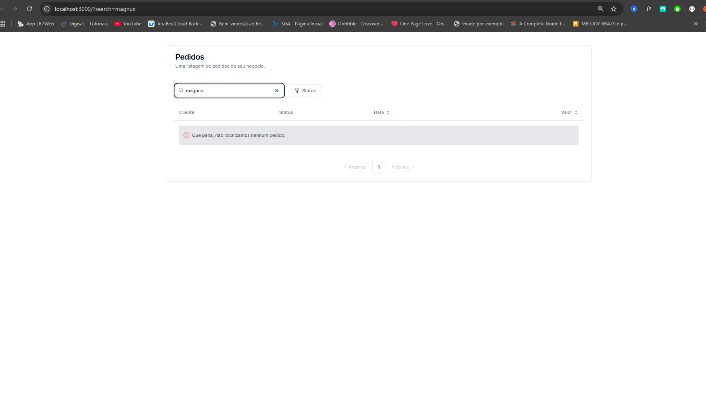

# Projeto realizado da plataforma codante - Busca, filtro, ordenação e paginação.

> O projeto consistiu em implementar todas as técnicas acima consumindo Api com Axios e realizando todas as chamadas direto pelo backend com nextjs.

## Tecnologias utilizadas:

- NextJS
- Axios
- Tailwindcss
- ShadcnUI
- Lucide React

### Desafio:
> Quando um dev front-end pensa em busca, filtro, ordenação e paginação, provavelmente pensa em usar métodos como Array.filter() ou Array.sort() diretamente no front. Mas e se tivermos 100, 500, 1000 itens paginados de 10 em 10? Gerenciar isso pelo front é uma tarefa hercúlea - e pior, não muito eficiente.

>Neste Mini Projeto, vamos implementar uma API que retorna uma listagem de pedidos. Por mais simples que pareça, essa é uma API poderosa: ela nos permite passar, como query parameters, busca textual, filtro, ordenação e paginação. E o melhor de tudo: todas essas informações ficarão na URL para fácil compartilhamento!

**Tudo isso no front usando Next.js e Server Components!**

### Tela inicial

### Feedback usuários

### Além do que o projeto inicial pedia:
> Para avançar com alguns conhecimentos decidi fazer uma correção no projeto que era referente ao hovers do botões de Previous e Next, e foi implementado também um feedback ao usuário quando uma busca não é satisfeita.
